# Manuale utente del progetto H-CLUS estensione
### Manuale redatto dal gruppo CASTDIPFALL
---
---

### Indice
1. [Introduzione](#1-introduzione)
    - 1.1 [Struttura del progetto](#11-struttura-del-progetto)
    - 1.2 [Gruppo di lavoro](#12-gruppo-di-lavoro) 

2. [Guida di installazione (con Jar+ Bat+ Script SQL)](#2-guida-di-installazione)

3. [Come eseguire H-Clus](#3-come-eseguire-h-clus)
    - 3.1 [Esecuzione del server](#31-esecuzione-del-server)
    - 3.2 [Esecuzione del client](#32-esecuzione-del-client)

4. [Diagramma delle classi](#4-diagramma-delle-classi)

5. [JavaDoc](#5-javadoc)

6. [Casi di test](#6-casi-di-test)
---
---

## **1. Introduzione**
Il progetto svolto, denominato _H-CLUS_, è stato assegnato e sviluppato durante il corso di Metodi Avanzati di Programmazione.
Il concetto alla base del progetto è il _data mining_, ossia l’estrazione (semi) automatica di conoscenza nascosta in voluminose basi di dati al fine di renderla disponibile e direttamente utilizzabile.

Dati una collezione $D$ di transazioni (vettore di valori misurati per una collezione di attributi numerici) ed un intero $k$, partizionare $D$ in $k$ insiemi, tale che:
- $D_i$ (i = 1, …, k) è un segmento omogeneo di $D$
- $D$ =$\bigcup_{i}^{k}D_i$ e $D_i$∩$D_j$ = ∅

L'obiettivo è implementare una soluzione mediante un sistema Client-Server per il clustering gerarchico di valori interi.

---
### 1.1 Struttura del progetto
Il progetto è stato sviluppato in linguaggio _Java_ e si compone di due elementi principali:
- **Server**: funzionalità di data mining per la scoperta di un dendrogramma di cluster di dati con algoritmo di _clustering_ 
agglomerativo, attraverso richieste Client
- **Client**: applicativo che consente di usufruire del servizio di scoperta remoto e visualizzare la conoscenza (cluster) scoperta

---
### 1.2 Gruppo di lavoro
Il progetto è sviluppato dagli studenti:
- **Leoluca Castellano**
    - MATRICOLA: 776053
    - E-MAIL ISTUZIONALE: l.castellano18@studenti.uniba.it
- **Giuseppe Pio Fallucca**
    - MATRICOLA: 782111
    - E-MAIL ISTUZIONALE: g.fallucca@studenti.uniba.it
- **Claudio Di Pietro**
    - MATRICOLA: 727701
    - E-MAIL ISTUZIONALE: c.dipietro4@studenti.uniba.it

---
---
## **2. Guida di installazione**
Affinchè sia possibile utilizzare il programma nella sua interezza è necessario installare alcuni componenti software:

1. **Java Development Kit (JDK):**

JDK è un insieme di strumenti necessari per sviluppare ed utilizzare applicazioni Java. Include il compilatore (per tradurre il codice sorgente Java in bytecode eseguibile dalla JVM - Java Virtual Machine), un ambiente di runtime (JRE - Java Runtime Environment) per eseguire il bytecode, e varie librerie standard. 
Questo strumento risulta essere indispensabile per scrivere, compilare e testare programmi Java.

- E' necessario installare JDK versione 17 o successiva, accedendo al sito ufficiale di Oracle e selezionando il download per il proprio sistema operativo: [scarica JDK](https://www.oracle.com/java/technologies/downloads/#java17)

2. **MySQL:**

MySQL è un sistema di gestione di database relazionali (DBMS) che serve per memorizzare, organizzare e gestire grandi quantità di dati. Utilizza il linguaggio SQL (Structured Query Language) per eseguire operazioni come inserimenti, aggiornamenti, eliminazioni e query sui dati.

- E' necessario installare MySQL versione 8.0.39 o successiva, accedendo al sito ufficiale di  MySQL Community Server e selezionando il download per il proprio sistema operativo: [scarica MySQL](https://dev.mysql.com/downloads/mysql/)

Successivamente effettuare le seguenti operazioni, affinchè l'installazione di MySQL avvenga in maniera corretta:
    
- Dalla barra di ricerca di Windows cercare "variabili d'ambiente".    
- Selezionare `Modifica le variabili d'ambiente relative al sistema`.
- Nella finestra `Avanzate`, cliccare su `Variabili d'ambiente...`.
- Nella sezione `Variabili di sistema`, selezionare la variabile `Path`, quindi cliccare su `Modifica...`.
- Cliccare su `Nuovo`, `Sfoglia file...` e aggiungere il percorso della cartella 'bin' (si trova nella cartella di installazione di MySQL).
- Cliccare su `OK`per chiudere tutte le finestre aperte.

Per verificare la corretta installazione di MySQL, aprire il prompt dei comandi. Digitare `mysql --version` e premere `Invio`.
Se le operazioni descritte precedentemente sono state effettuate correttamente, verrà mostrata la versione di MySQL.

**N.B.** E' importante memorizzare le proprie informazioni d'accesso all'account MySQL (_username_ e _password_), poichè saranno necessarie per avviare il Server.

---
---

## **3. Come eseguire H-Clus**
E' possibile avviare un unico _Server_.

Per avviare Server e Client sono stati definiti i file batch `Server_GUI.bat` e `Client_GUI.bat`.
Un file batch è un file di testo che contiene una serie di comandi eseguibili da un interprete di comandi, come il prompt dei comandi di Windows. Questi file vengono utilizzati per automatizzare attività ripetitive, eseguendo una sequenza di comandi in modo sequenziale quando il file viene eseguito.
Pertanto è necessario avviare tali file per eseguire il codice dei rispettivi elementi del progetto (Server e Client).

### **3.1 Esecuzione del server**
Il file `Server_GUI.bat` avvia il Server sulla porta _2025_.
Il valore _2025_ è stato definito in fase di programmazione, ma è possibile utilizzare qualsiasi altra porta (es: qualora la porta 2025 sia già utilizzata) purchè non sia attivo qualsiasi servizio su essa.
Qualora si volesse modificare il valore, aprire e modificare il file `Server_GUI.bat` sostituendo il valore _2025_ con il nuovo valore.

E' possibile eseguire il file in due modi differenti:
1. Individuare il file `Server_GUI.bat` nella directory del progetto e fare _doppio clic_ su esso.

2. Aprire il prompt dei comandi od un altro terminale:
    
    E' possibile farlo in due modi:
    - Digitare _Prompt dei comandi_ oppure _cmd_ nel menu _Start_
    - Eseguire la combinazione di tasti _Windows + R_ e digitare cmd, infine premere _OK_.
    
    Navigare fino alla directory dove si trova il file. Eseguire il comando: `Server_GUI.bat`.

Verrà aperta l'applicazione lato server. E' necessario attivare il server: premere il tasto _Start Server_.
Successivamente verrano mostrati:
   - numero di porta, sul quale è connesso il Server
   - elenco dei client connessi e disconnessi

Il file `setup.sql` contiene le istruzioni SQL per generare il database _MapDB_ e la tabella _exampleTab_, necessari per generare il dendogramma. E' possibile modificare il file, aggiungere nuove tabelle o ulteriori tuple nella tabella esistente.

---
### **3.2 Esecuzione del client**
Il file `Client_GUI.bat` avvia il Client e necessita la definizione dell'indirizzo IP del dispositivo e della porta.
Di default sono stati impostati i valori _127.0.0.1_ ed _2025_ rispettivamente. Entrambi i valori possono essere modificati dall'utente, qualora ne abbia bisogno.

RICORDA: sulla porta che andrai a specificare non deve essere attivo qualsiasi altro servizio.
Qualora si volesse modificare i valori, aprire e modificare il file `Client_GUI.bat`.

E' possibile eseguire il file in due modi differenti:
1. Individuare il file `Client_GUI.bat` nella directory del progetto e fare _doppio clic_ su esso.

2. Aprire il prompt dei comandi od un altro terminale:
    - Digitare _Prompt dei comandi_ oppure _cmd_ nel menu _Start_
    - Eseguire la combinazione di tasti _Windows + R_ e digitare cmd, infine premere _OK_.
    
    Navigare fino alla directory dove si trova il file. Eseguire il comando: `Client_GUI.bat`.

In entrambi le modalità, il file batch eseguirà il file JAR del Client con l'indirizzo e la porta specificata.

Verrà aperta l'applicazione lato client. E' necessario attivare il client: premere il tasto _Connect_.

---
---
## **4. Diagramma delle classi**
Tutti i diagrammi delle classi sono stati creati utilizzando UML (Unified Modeling Language) per garantire una rappresentazione standardizzata delle strutture e delle relazioni tra le varie classi. Per questo processo, abbiamo scelto di utilizzare StarUML, un software di modellazione che facilita la creazione, la visualizzazione e la gestione di diagrammi UML.

### Diagramma CLIENT completo
---

    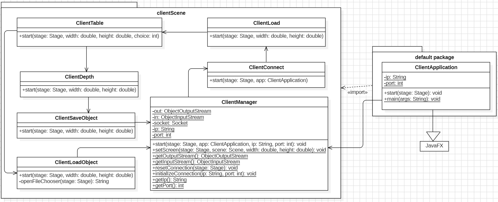

### Diagramma DEFAULT PACKAGE del CLIENT
---

    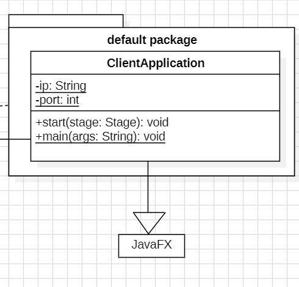

### Diagramma PACKAGE CLIENTSCENE del CLIENT
---

    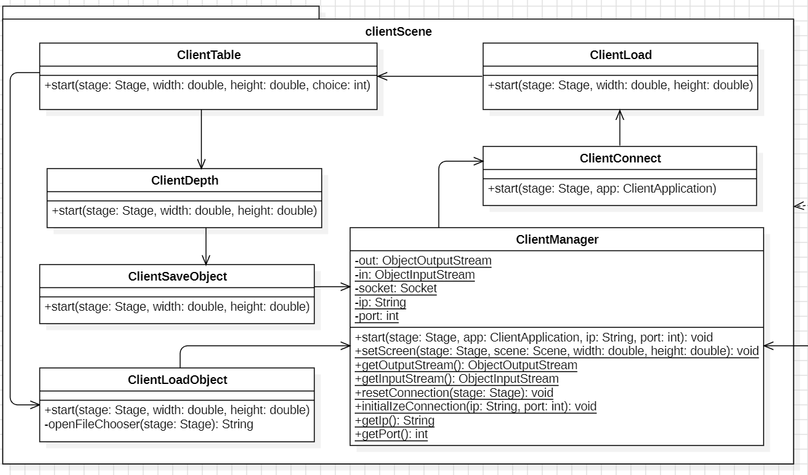

### Diagramma SERVER completo
---

    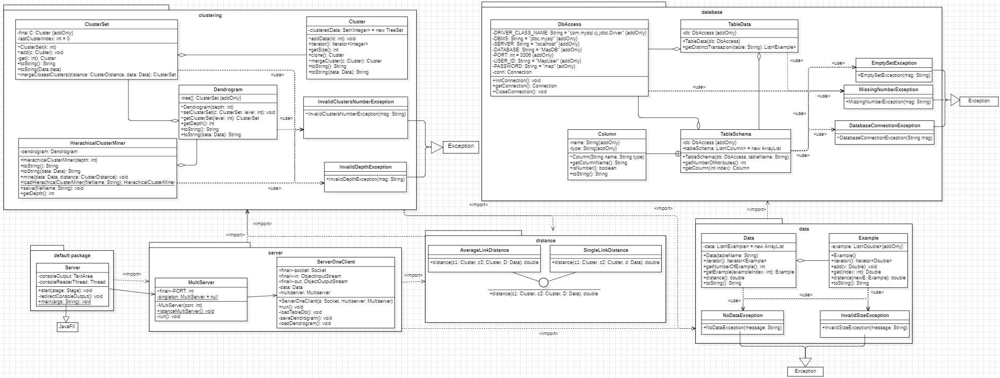

### Diagramma DEFAULT PACKAGE del SERVER
---

    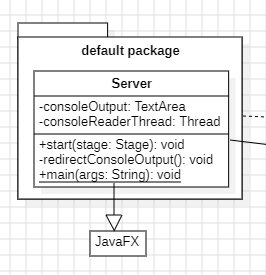

### Diagramma PACKAGE CLUSTERING del SERVER
---

    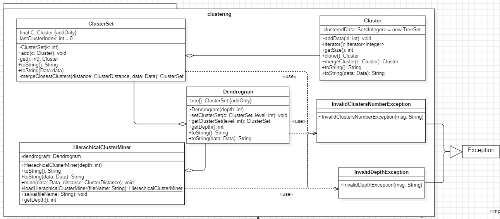

### Diagramma PACKAGE DISTANCE del SERVER
---

    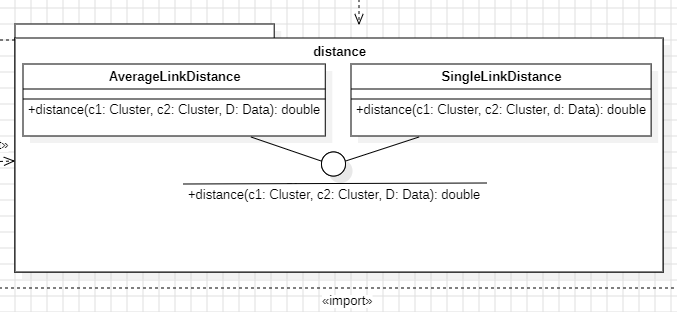

### Diagramma PACKAGE DATA del SERVER
---

    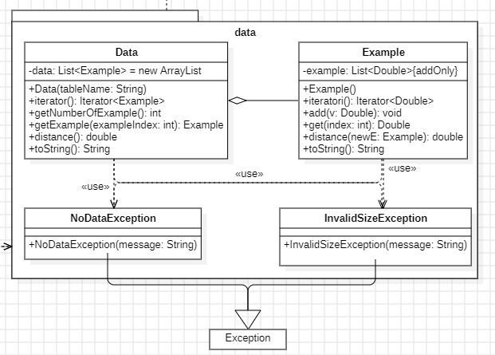

### Diagramma PACKAGE DATABASE del SERVER
---

    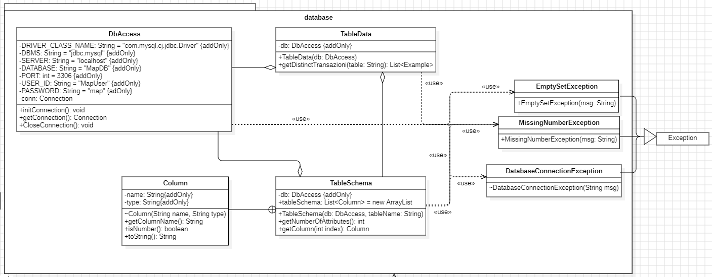

### Diagramma PACKAGE SERVER del SERVER
---

    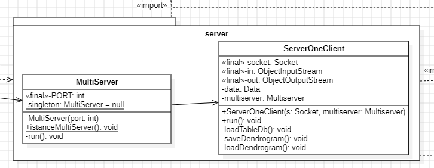

---
---

## **5. JavaDoc**
Javadoc è uno strumento di documentazione utilizzato per generare automaticamente la documentazione API in formato HTML per il codice sorgente Java. Viene incluso nel Java Development Kit e si basa su commenti speciali inseriti nel codice sorgente. 

Per visualizzare il Javadoc del client è possibile aprire il file `index.html` presente nella cartella _\H-CLUS-Estensione\ClientGui\javadoc_ .

Per visualizzare il Javadoc del server è possibile  aprire il file `index.html` presente nella cartella _\H-CLUS-Estensione\ServerGui\javadoc_ .

---
---
## **6. Casi di test**

### Casi di test black-box
Sono stati eseguiti test di sistema utilizzando l'approccio black-box. Questo metodo ci ha permesso di valutare il comportamento del sistema nel suo insieme, concentrandoci sulle funzionalità e sui requisiti senza valutare i dettagli dell'implementazione del codice. Quindi, questa sezione analizza aspetti lato client.
Di seguito vengono elencati i test effettuati ed i risultati ottenuti.

---
### Schermata di avvio server
Test di verifica sulla corretta visualizzazione della schermata d'avvio del server:

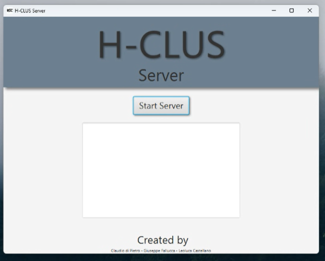

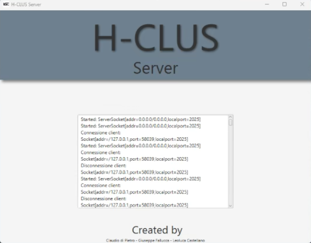

La schermata di avvio mostra l'elenco dei client connessi.
In particolare, per ogni client è possibile visualizzare se è connesso o disconnesso e le sue informazioni.

---
### Schermata di avvio client
Test di verifica sulla corretta visualizzazione della schermata d'avvio del client:

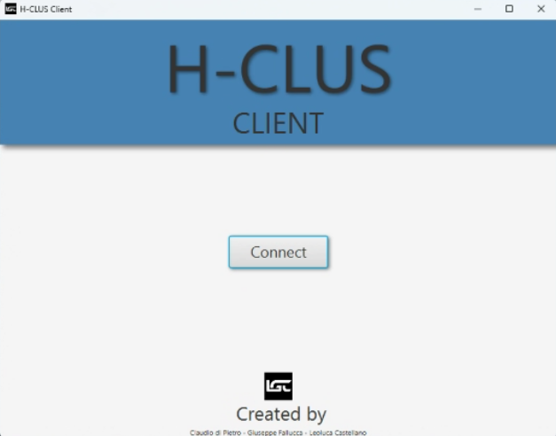

Per effettuare le operazioni è necessario premere il bottone 'Avvio'. 

---
### Inserimento nome tabella corretto
Test per l'inserimento di un nome corretto di una tabella:

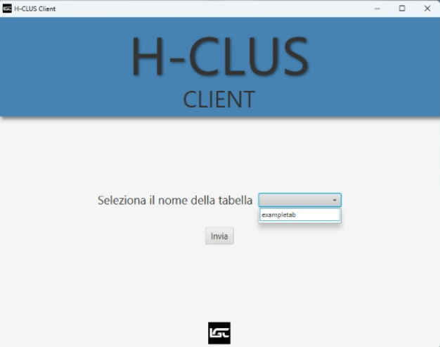

---
### Inserimento nome tabella non selezionato
Test per avviso del mancato inserimento di una tabella:

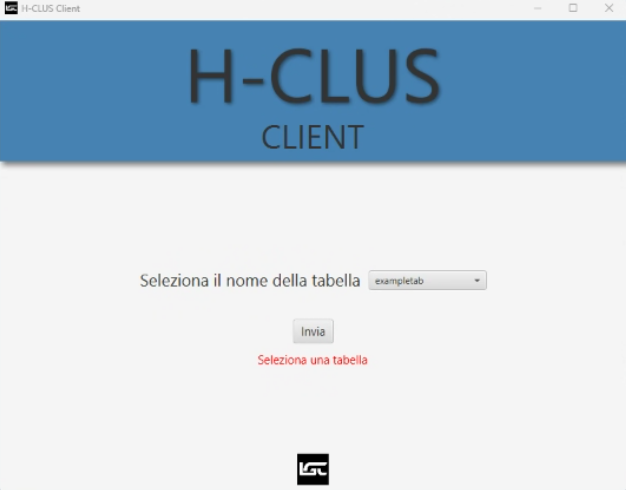

Avviso di possibile scelta di una tabella.

---
### Scelta 1 
Test per la scelta dell'operazione. L'utente sceglie il caricamento del dendrogramma da file: 

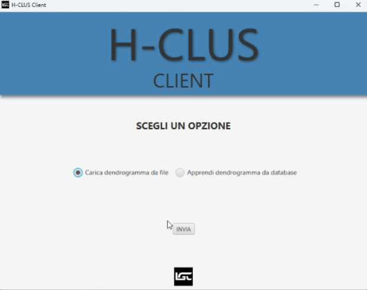 

---
### Scelta 2
Test per la scelta dell'operazione. L'utente sceglie di apprendere il dendrogramma da database:

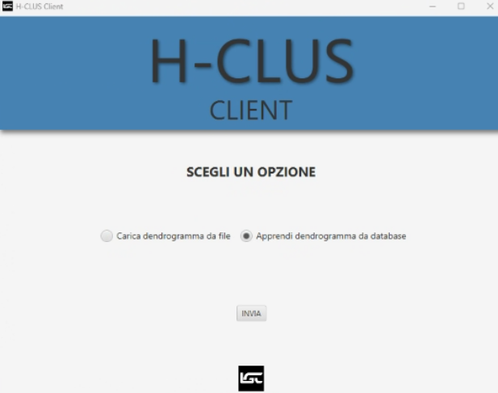 

---
### Scelta 1: Caricamento da file corretto
Test per il caricamento di un dendrogramma da file binario. L'utente seleziona un file corretto.

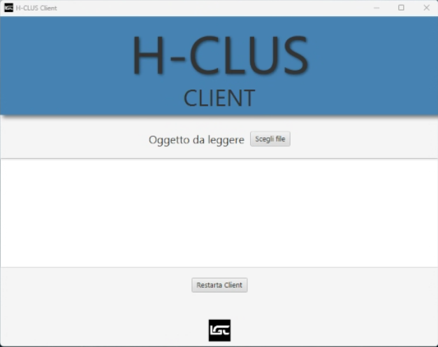

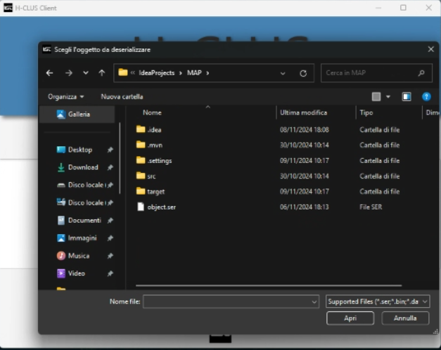

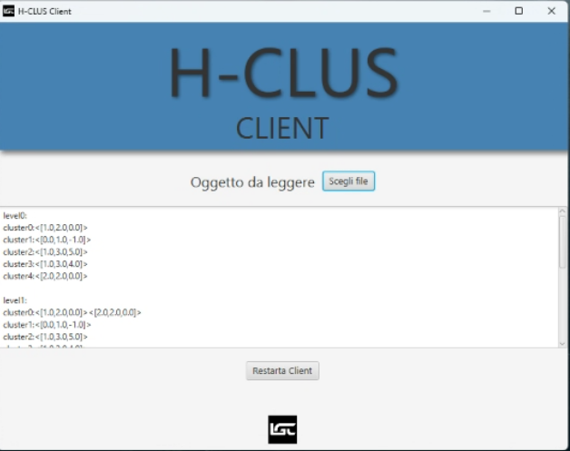

In questi casi, e per tutti i file con estensione accettata, il programma stamperà il dendrogramma. I file con estensione non accettata nella fase di scelta del file non sono visibili e di conseguenza no selezionabili.

---
### Scelta 2: Scelta profondità
Test per l'inserimento della profondità durante l'apprendimento del dendrogramma da database:

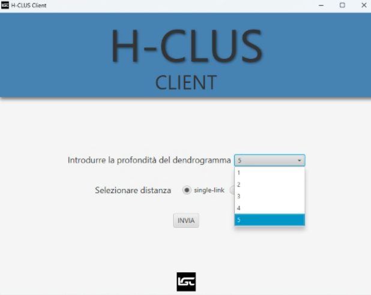

---
### Scelta 2: Scelta tipologia algoritmo  
Test per la scelta di algoritmo Single-Link da utilizzare durante l'apprendimento del dendrogramma da database:

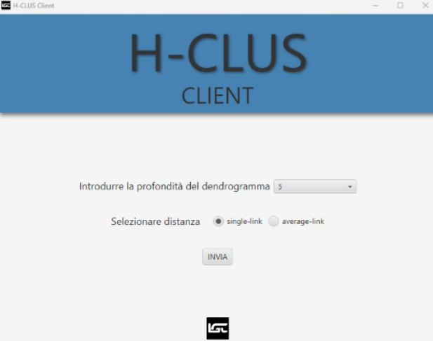

Test per la scelta di algoritmo Average-Link da utilizzare durante l'apprendimento del dendrogramma da database:

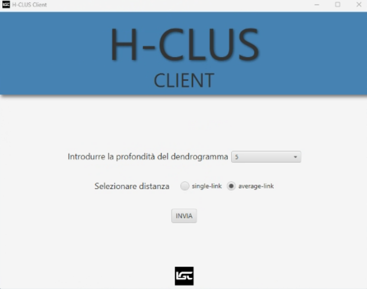

In entrambi i casi verrà mostrato a video il dendrogramma risultante e sarà possibile salvarlo su file.

---
### Scelta 2: Test per inserimento nome file
Test per l'inserimento del nome corretto di un file su cui salvare dendrogramma:

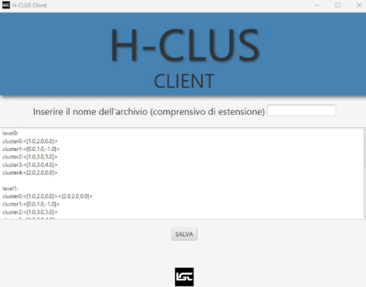 

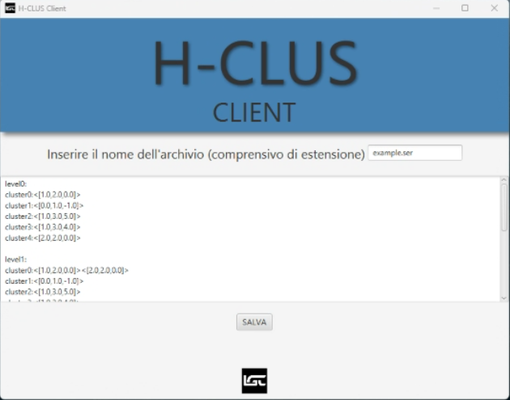 

Il dendrogramma viene salvato nel file specificato.

---
### Scelta 2: Test per inserimento nome file errato
Test per l'inserimento del nome di un file con estensione errata o senza estensione:

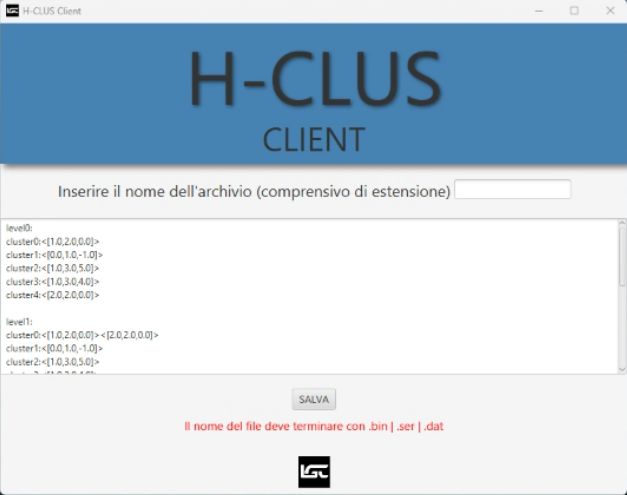

---
---

### Casi di test white-box
I test di sistema condotti utilizzando l'approccio white-box si concentrano sulla verifica delle funzionalità del sistema tenendo conto della sua struttura interna, del codice sorgente e della logica di funzionamento.
Di seguito vengono elencati i test effettuati ed i risultati ottenuti.

---
### Test di avvio del Client con Server spento
Test di avvio del Client tenendo appositamente il Server spento:

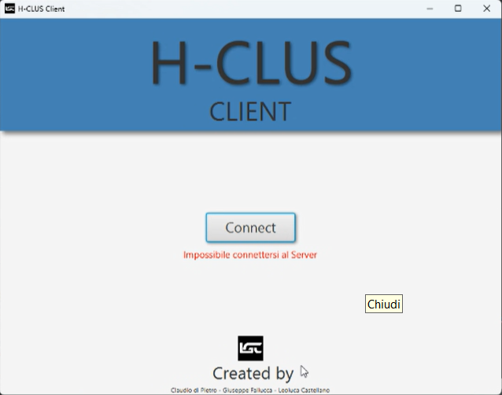 

---
### Test di avvenuta connessione al Server
Test di verifica della connessione, e successiva disconnessione, di Client al Server:

 

---
### Test di avvio del Server che non trova driver MySql
Test di avvio del Server su un numero di porta errato:

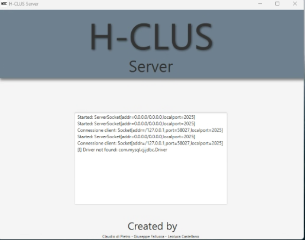

---
---